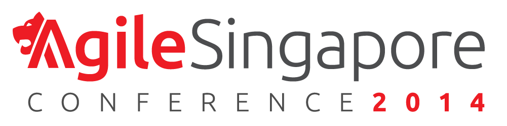
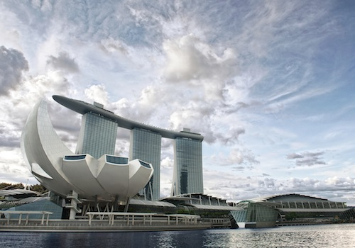

  

    

      

        
      

    

    

      

        <h2>{{ page.dates }}</h2>
        <h4>{{ page.ready }}</h4>
      

    

  

  

    <h2>{{ page.lastyear }}</h2>
    
{{ page.lastyear-more }}

  

  

    <h2>{{ page.sponsors }}</h2>
    
{{ page.sponsors-more }}

  

  

    <h2>{{ page.speakers }}</h2>
    
{{ page.speakers-more }}

  

  

    

      

        <h2>{{ page.interview }}</h2>
        

      

    

    

      

        

            <iframe width="500" height="281" src="//www.youtube.com/embed/nicXTTQ-zG0" frameborder="0" allowfullscreen></iframe>
        

      

      

        

            <iframe width="500" height="281" src="//www.youtube.com/embed/Zb95ry-ZTUI" frameborder="0" allowfullscreen></iframe>
        

      

    

    

      

        
"Great conference, hope to be there next year!"

        
"Kevlin blew my mind with the presentation about Craftmanship"

        
"It was a great honor and pleasure to speak amongst such distinguished names in the Agile community"

      

    

  

  

    

      

        
      

      

        <h3>{{ page.thisyear }}</h3>
        
{{ page.thisyear-more }}

        
{{ page.callout }}
        <a href="http://eepurl.com/L5BAb" class="btn btn-lg btn-primary">Subscribe here!</a>

      

    

  

