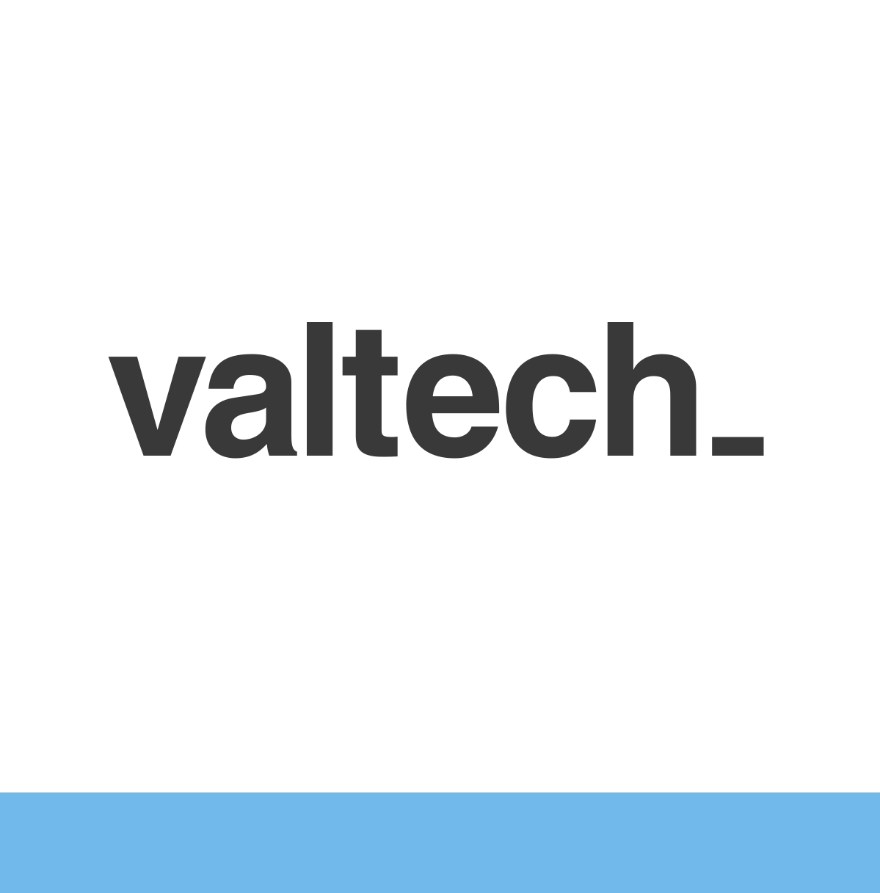
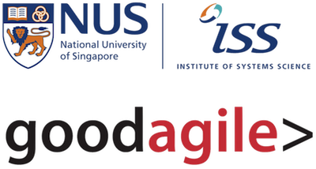
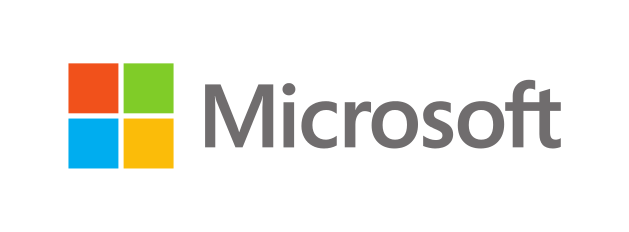
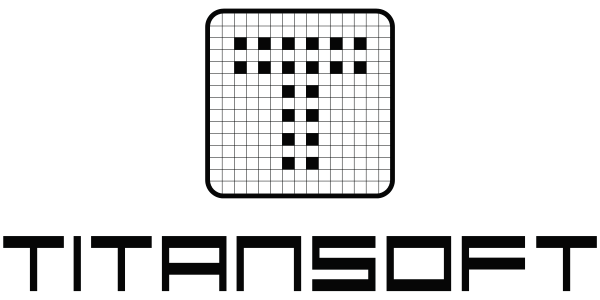
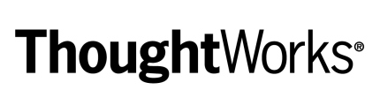
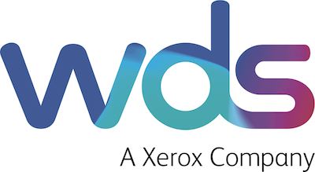
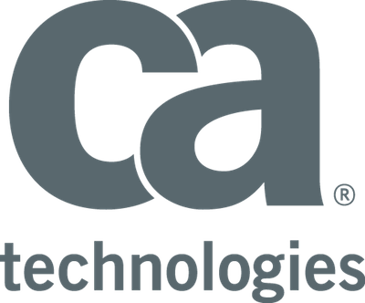
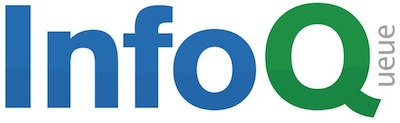
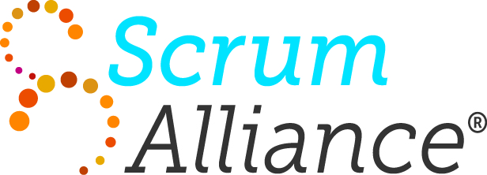
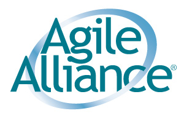

  

    <h1 class="page-header">Sponsors</h1>

	<h3>Title Sponsors</h3>

    

        

			&nbsp;
        

    

    

        

          

            
          

        

        

          
<a href="http://odd-e.com" target="_blank">Odd-e</a>, based throughout east Asia, are self-governing teams of highly skilled and experienced software developers, coaches and trainers. Their software products are crafted so skillfully they actually cost less time and money than seemingly cheaper alternatives. Because of this built-in quality the product remains soft and easier to change meaning reduced overall costs and delays in the longer-term. We uphold the values of Scrum, Agile, Lean, and Craftsmanship both with our clients and within Odd-e. For example, we don't have an organisational hierarchy; No managers making decisions for others and no assistants being managed. We keep our space open to new thinking and leaderful teamwork with each team member able to use appropriate skills and continuously improve individual and team competence.

        

    

    

        

          

            
          

        

        

          
<a href="http://www.rallydev.com/asia" target="_blank">Rally Software</a> is a leading global provider of enterprise-class software and services solutions that drive business agility. Companies use Rally Software’s solutions to accelerate the pace of innovation, improve productivity, and respond effectively to evolving competitive markets and customer needs. Rally Software’s SaaS platform transforms the way organizations manage the software development lifecycle by aligning software development and strategic business objectives, facilitating collaboration, and increasing transparency. Rally Software’s consulting and training services apply Agile and Lean approaches to help organizations innovate, lead, adapt, and deliver.

        

    

    

    

	<h3>Platinum Sponsors</h3>

    

        

			&nbsp;
        

    

    

        

          

            
          

        

        

          
JPMorgan Chase & Co. (NYSE: JPM) is a leading global financial services firm with assets of $2.5 trillion and operations worldwide. The Firm is a leader in investment banking, financial services for consumers and small businesses, commercial banking, financial transaction processing, and asset management. A component of the Dow Jones Industrial Average, JPMorgan Chase & Co. serves millions of consumers in the United States and many of the world's most prominent corporate, institutional and government clients under its J.P. Morgan and Chase brands. Information about JPMorgan Chase & Co. is available at <a target=_blank href="http://www.jpmorgan.com">www.jpmorgan.com</a>

        

    

    

			     Your company could be featured here
    

	<h3>Gold Sponsors</h3>

    

        

			&nbsp;
        

    

    

        

          

            
          

        

        

          
For over 22 years <a target=_blank href="http://www.softed.com">Software Education</a> has been at the forefront of Software Development training. With a complete suite of courses that cover all roles and activities on Agile teams, we have trained and coached over 7,000 staff in adopting Agile concepts since 2007. Adopting Agile practices requires much more than attending a training course; for many organisations it is a fundamental shift in the way they work, and Software Education’s experts work with the whole organisation delivering training, providing advice and support, coaching and mentoring at all levels to help ensure the organisation achieves the benefits of the Agile culture and mind-set.

        

    

    

        

			&nbsp;
        

    

    

        

          

            
          

        

        

          
<a target=_blank href="http://sg.valtech.com">Valtech</a> is a new breed of technology and marketing digital agency. We are full service and operate across all project lifecycle from strategy and consulting to maintenance and optimization. Our way is the agile way. And it goes far beyond software development. According to the client's needs, we bring together our tribes of seasoned experts: digital strategists, scrum masters, strategic planners, designers, developers, web analytics experts, agile coaches. Agile enables us to work better together and with our clients following methodologies: defining objectives and identifying main issues from the start, focusing on clear priorities and providing solutions where they matter most.

        

    

    

        

			&nbsp;
        

    

    

        

          

            
            <map name="iss-goodagile-map">
              <area shape="rect" coords="0,0,200,50" href="http://www.iss.nus.edu.sg" target="_blank">
              <area shape="rect" coords="0,60,200,120" href="http://goodagile.com" target="_blank">
            </map>
          

        

        

          
Institute of Systems Science (ISS) at the National University of Singapore and GoodAgile have partnered to deliver Certified ScrumMaster. ISS provides graduate education, professional development courses, consultancy and research services. Appointed as a Continuing Education and Training Centre for the National Infocomm Competency Framework, ISS offer short courses in areas of enterprise IT, agile, project management, service innovation and more. GoodAgile is a leading Agile training and coaching organisation in Asia.  Founded by Pete Deemer, co-author of The Scrum Primer, GoodAgile works with some of the largest companies in the world to achieve exceptional results using Agile. Visit <a target=_blank href="http://www.iss.nus.edu.sg">www.iss.nus.edu.sg</a> or <a target=_blank href="http://goodagile.com">goodagile.com</a> for more info.

        

    

    

        

      &nbsp;
        

    

    

        

          

            
          

        

        

          
Microsoft Visual Studio &amp; Team Foundation Server is the state-of-the-art development solution that helps organizations to be agile, delivering high-quality software in faster cycles. The solution adapts to their processes and removes barriers between business stakeholders, development teams, testing and operations. It allows them to incrementally adopt agile best practices that best meet the needs of organizations with out-of-the-box support for lightweight requirements, capacity planning, task boards and backlog management, agile portfolio management. And with advanced testing tooling for quality checks throughout the development process, it reduces barriers to development and test collaboration. For more information, visit <a target="_blank" href="http://www.microsoft.com/visualstudio/eng/alm/overview">Visual Studio</a>.

        

    

    

        

			&nbsp;
        

    

    

        

          

            
          

        

        

          
Titansoft Pte Ltd is a Singapore-based software development company providing software consultancy and tailor-made solutions for the global e-gaming industry. Our cutting-edge software and IT services span across e-gaming solutions, system management, network security, and more. By promoting adaptive planning and evolutionary development, we are able to incorporate rapid and flexible response to changes. The success of our products is attributed to this agile paradigm where every aspect of product development is continually revisited. We are proud to achieve efficient, competitive product delivery with reduced integration lead time to our clients. Find out more about us at: <a target="_blank" href="http://www.titansoft.com.sg">www.titansoft.com.sg</a>

        

    

    

        

			&nbsp;
        

    

    

        

          

            
          

        

        

          
<a target="_blank" href="http://www.thoughtworks.com">ThoughtWorks</a> is a software company and community of passionate individuals whose purpose is to revolutionise software creation and delivery, while advocating for positive social change. Our clients are people and organisations with ambitious missions; we deliver disruptive thinking and technology to empower them to succeed. Over 2500 ThoughtWorks employees - 'ThoughtWorkers' - serve clients from offices in Australia, Brazil, Canada, China, Ecuador, Germany, India, Singapore, South Africa, Uganda, the U.K. and the U.S.

        

    

    

        

			&nbsp;
        

    

    

        

          

            
          

        

        

          
WDS, A Xerox Company is a global leader in the delivery of transformational customer care solutions. Built around a cognitive technology platform that continually learns from the customer care transactions that pass through it, WDS help clients to leverage their existing data assets to increase efficiency across the care-mix; from improved agent performance to self-care automation and personalization. Quite simply, WDS enable customers to find the answers they need and ensure that every customer care experience is better than the last.  To find out more, please visit <a target="_blank" href="http://www.wds.co">www.wds.co</a>

        

    

    

			     Your company could be featured here
    

	<h3>Silver Sponsors</h3>

    

        

			&nbsp;
        

    

    

        

          

            
          

        

        

          
NCS is a leading infocommunications technology (ICT) service provider and together with SingTel, we have a presence in 22 countries located throughout APAC, Europe and the USA. NCS delivers end-to-end ICT and communications engineering solutions to help governments and enterprises realise business value through the innovative use of technology. Our unique delivery capabilities range across consulting, development, systems integration, outsourcing, infrastructure management &amp; solutions and portal management. We also deliver mobility, social media, portal management, machine-to-machine communications, analytics and business intelligence in our solution offerings to our customers. Headquartered in Singapore, NCS has over 8,000 staff serving governments and large global commercial enterprises. For more information on NCS, visit <a target=_blank href="http://www.ncs.com.sg">www.ncs.com.sg</a>.

        

    

    

        

			&nbsp;
        

    

    

        

          

            
          

        

        

          
<a target=_blank href="http://www.ca.com/sg">CA Technologies</a> creates software that fuels transformation for companies and enables them to seize the opportunities of the application economy. From planning to DevOps to security to systems management, our solutions power innovation and drive competitive advantage for businesses everywhere. We help organizations to drive enterprise-wide productivity, offer differentiated user experiences and open new growth opportunities. And, we are able to deliver this value across multiple environments – mobile, private and public cloud, distributed and mainframe. Recognized by our customers as a critical partner in their IT transformation, CA is working with companies worldwide to change the way we live, transact and communicate.

        

    

    

           Your company could be featured here.
    

	<h3>Media Sponsor</h3>

    

        

			&nbsp;
        

    

    

        

          

            
          

        

        

          
Software is changing the world. InfoQ, a news and community site with content currently published in English, Chinese, Japanese, French and Brazilian Portuguese, empowers software developers to be agents of change in their industries. Along with QCon, our practitioner-driven conferences, InfoQ's purpose is to facilitate the spread of knowledge and innovation in enterprise software development. As of 2013, InfoQ.com's readership base is over 850,000 unique visitors per month reading content from 100 locally-based editors across the globe. Our goal is to continue to build localized language communities.

        

    

    

        

			&nbsp;
        

    

	<h3>Coffee-break Sponsor</h3>

    

        

			&nbsp;
        

    

    

        

          

            
          

        

        

          
Become part of something bigger than you alone. With over 300,000 members world-wide, <a target=_blank href="http://www.scrumalliance.org">Scrum Alliance</a> brings you together with like-minded people who are passionate about Scrum and who dream, explore – and live – project management brilliance every day. A nonprofit professional organization, we provide advocacy, community, and education to support this movement, equip our members, and help them succeed with Scrum in software development and beyond. Come sprint with us!

          
Join the Largest Scrum Community for FREE!
Scrum is an ongoing journey.  And it’s important to surround yourself with the best minds, ideas and advice along the way. Find all this and more at Scrum Alliance, the place to learn and talk about Scrum. Become part of our Scrum Community for free as a SCRUM ALLIANCE® Basic Member.
<a target=_blank href="http://www.scrumalliance.org/freemembership">http://www.scrumalliance.org/freemembership</a>

        

    

	<h3>Supporters</h3>

    

        

			&nbsp;
        

    

    

        

          

            
          

        

        

          
The mission of the Infocomm Development Authority of Singapore (IDA) is to develop information technology and telecommunications within Singapore with a view to serve citizens of all ages and companies of all sizes. IDA does this by actively supporting the growth of innovative technology companies and start-ups in Singapore, working with leading global IT companies as well as developing excellent information technology and telecommunications infrastructure, policies and capabilities for Singapore.

        

    

    

        
&nbsp;

    

    

        

          

            
            <map name="sitf-map">
              <area shape="rect" coords="0,0,100,40" href="http://sitf.org.sg" target="_blank">
              <area shape="rect" coords="100,0,400,40" href="http://theportal.sg" target="_blank">
            </map>
          

        

        

          
Singapore infocomm Technology Federation (SiTF) comprises corporate members ranging from startups to establish MNCs. SiTF advocates for the ICM industry and helps to accelerate the adoption ICM technology. SiTF works closely with stakeholders to promote emerging technologies and provide opportunities to help members increase their market presence and business reach. Among the key events are Golf, SiTF Awards, SITEX and ICT Business Summit. The key initiatives include MatchiT, PartneriT, 123JumpStart, SiTF Academy, PPPO and The Portal.

        

    

    

        
&nbsp;

    

    

        

          

			
          

        

        

          
The Agile Alliance is a nonprofit organization with global membership, committed to advancing <a target=_blank href="http://www.agilealliance.org/the-alliance/the-agile-manifesto">Agile development principles and practices</a>. Agile Alliance supports those who explore and apply Agile principles and practices in order to make the software industry more productive, humane and sustainable. We share our passion to deliver software better everyday.

        

    

  

