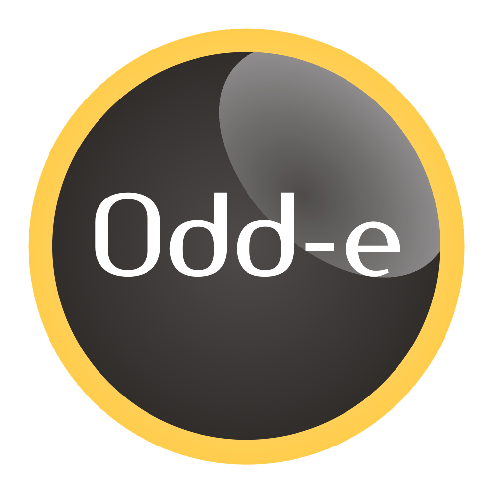

  

    <h1 class="page-header">Sponsors</h1>

	<h3>Title Sponsors</h3>

    

        

          

            
          

        

		
		
        

          <h2>Odd-e</h2>
          
Odd-e, based in Asia, builds products in innovative ways and helps others achieve so. Our team consists of experienced coaches and product developers who work according to the values of Scrum, Agile, Lean, and Craftsmanship. We also use these values to structure and run our company. For example, we don't have an organisational hierarchy or managers making decisions for others. We expect each individual to self-organize and use all his skills and continuously improve his competence.

        

    

	<h3>Platinum Sponsors</h3>
		
	<h3>Gold Sponsors</h3>
		
	<h3>Silver Sponsors</h3>
		
  

