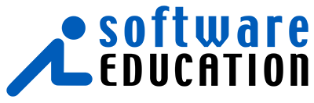
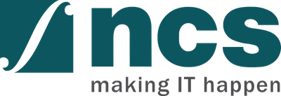

  

    <h1 class="page-header">Sponsors</h1>

	<h3>Title Sponsors</h3>

    

        

			&nbsp;
        

    

    

        

          

            
          

        

        

          
<a href="http://odd-e.com" target="_blank">Odd-e</a>, based throughout east Asia, are self-governing teams of highly skilled and experienced software developers, coaches and trainers. Their software products are crafted so skillfully they actually cost less time and money than seemingly cheaper alternatives. Because of this built-in quality the product remains soft and easier to change meaning reduced overall costs and delays in the longer-term. We uphold the values of Scrum, Agile, Lean, and Craftsmanship both with our clients and within Odd-e. For example, we don't have an organisational hierarchy; No managers making decisions for others and no assistants being managed. We keep our space open to new thinking and leaderful teamwork with each team member able to use appropriate skills and continuously improve individual and team competence.

        

    

    

        

          

            
          

        

        

          
Rally Software is a leading global provider of enterprise-class software and services solutions that drive business agility. Companies use Rally Software’s solutions to accelerate the pace of innovation, improve productivity, and respond effectively to evolving competitive markets and customer needs. Rally Software’s SaaS platform transforms the way organizations manage the software development lifecycle by aligning software development and strategic business objectives, facilitating collaboration, and increasing transparency. Rally Software’s consulting and training services apply Agile and Lean approaches to help organizations innovate, lead, adapt, and deliver.

        

    

	<h3>Platinum Sponsors</h3>

    

        

			&nbsp;
        

    

    

        

          

            
          

        

        

          
J.P. Morgan's Corporate & Investment Bank is a global leader across banking, markets and investor services. The world's most important corporations, governments and institutions entrust us with their business in more than 100 countries. With US$18.9 trillion of assets under custody and US$369.1 billion in client deposits*, the Corporate & Investment Bank provides strategic advice, raises capital, manages risk and extends liquidity in markets around the world. Further information about J.P. Morgan is available at <a target=_blank href="http://www.jpmorgan.com">www.jpmorgan.com</a>

		  *As at 30 June, 2013
        

    

    

			     Your company could be featured here
    

	<h3>Gold Sponsors</h3>

    

        

			&nbsp;
        

    

    

        

          

            
          

        

        

          
For over 22 years <a target=_blank href="http://www.softed.com">Software Education</a> has been at the forefront of Software Development training. With a complete suite of courses that cover all roles and activities on Agile teams, we have trained and coached over 7,000 staff in adopting Agile concepts since 2007. Adopting Agile practices requires much more than attending a training course; for many organisations it is a fundamental shift in the way they work, and Software Education’s experts work with the whole organisation delivering training, providing advice and support, coaching and mentoring at all levels to help ensure the organisation achieves the benefits of the Agile culture and mind-set.

        

    

    

			     Your company could be featured here
    

	<h3>Silver Sponsors</h3>

    

        

			&nbsp;
        

    

    

        

          

            
          

        

        

          
NCS is a leading infocommunications technology (ICT) service provider and together with SingTel, we have a presence in 22 countries located throughout APAC, Europe and the USA. NCS delivers end-to-end ICT and communications engineering solutions to help governments and enterprises realise business value through the innovative use of technology. Our unique delivery capabilities range across consulting, development, systems integration, outsourcing, infrastructure management &amp; solutions and portal management. We also deliver mobility, social media, portal management, machine-to-machine communications, analytics and business intelligence in our solution offerings to our customers. Headquartered in Singapore, NCS has over 8,000 staff serving governments and large global commercial enterprises. For more information on NCS, visit <a target=_blank href="http://www.ncs.com.sg">www.ncs.com.sg</a>.

        

    

    

           Your company could be featured here.
    

  

